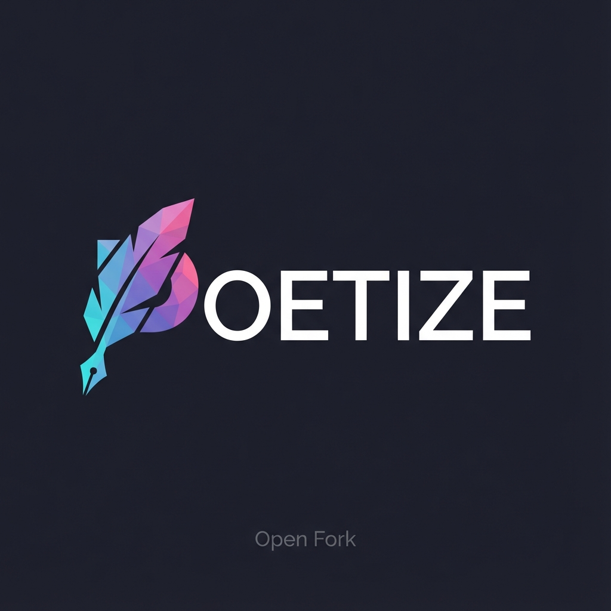

<p align="center">
  <a href="#">
    
  </a>

<h1 align="center">POETIZE 最美博客（AGPL 分支 · LeapYa 维护）</h1>
  <p align="center">
    让内容创作与社交体验更美好
    <br />
    <br />
    <a href="#-快速开始">快速部署</a>
    ·
    <a href="#-部署文档">部署文档</a>
    ·
    <a href="#-开发指南">二次开发</a>
  </p>
  <p align="center">
   
   
   
   
  </p>
</p>

## 📑 目录

- [项目简介](#-项目简介)
- [快速开始](#-快速开始)
- [部署文档](#-部署文档)
- [贡献与许可](#-贡献与许可)
- [开发指南](#-开发指南)
- [技术栈](#️-技术栈)
- [联系方式](#-联系方式)
- [版权说明](#-版权说明)

## 📖 项目简介

本项目**Awesome-poetize-open**是基于开源项目 [POETIZE最美博客](https://gitee.com/littledokey/poetize) 功能扩展和定制化开发，历时半年，这是一个集内容创作、社交互动与技术优化于一体的现代化博客系统，非常适合个人建站和内容创作者使用。

<p align="center">
  
</p>

<p align="center">博客首页 - 展示个人创作与生活点滴</p>

<p align="center">
  
  
</p>

<p align="center">左：内容布局展示 | 右：社交功能体验</p>

#### **本分支新增/优化功能**

1. ✅ 一键部署脚本 —— 一行命令自动完成环境配置、HTTPS配置和服务启动
2. ✅ 后台权限管理 —— 支持多角色分级管理，提升安全性
3. ✅ 多邮箱服务支持 —— 可配置多邮箱，提升邮件送达率
4. ✅ 第三方登录集成 —— 支持GitHub、Google、Twitter、Yandex、Gitee平台登录
5. ✅ 机器人验证功能 —— 集成点选、滑动验证码，防止恶意注册
6. ✅ SEO优化与预渲染 —— 自动生成sitemap、robots.txt及页面预渲染，极大提升搜索引擎收录与SEO效果
7. ✅ 看板娘优化 —— Live2D看板娘可自定义、支持AI互动
8. ✅ 导航栏优化 —— 支持自定义导航栏，布局更美观
9. ✅ 评论体验优化 —— 评论内容自动保存，未登录也不丢失
10. ✅ 增加兰空图床、简单图床的存储支持 —— 支持多种图片上传和存储方式
11. ✅ AI翻译 —— 支持中英互译，可用本地或API模型
12. ✅ 页脚优化 —— 页脚信息更丰富、可自定义
13. ✅ 图片压缩和转换WebP格式 —— 自动压缩图片，提升网站加载速度
14. ✅ 智能摘要 —— 自动生成文章摘要，提升阅读体验
15. ✅ 暗色模式优化、定时暗色模式 —— 支持夜间自动切换暗色主题，优化暗色模式
16. ✅ 灰色模式 —— 支持全站灰色纪念模式
17. ✅ 自定义错误页面 —— 提供友好的404、403等错误页面
18. ✅ 字体文件CDN化 —— 支持字体文件外部化存储与动态加载，可配置单一/分块字体模式，自定义Unicode范围，大幅减少网站带宽占用
19. ✅ 将MD5密码哈希升级为BCrypt算法 —— 修复密码安全漏洞
20. ✅ 评论区重构、优化其楼层计算算法优化 —— 对评论区进行重构，引入懒加载机制以提升页面加载速度，并使用深度优先遍历算法优化评论楼层计算逻辑，提高渲染性能
21. ✅ Redis缓存优化 —— 大部分接口使用Redis缓存，提升性能
22. ✅ 实现token签名算法HMAC-SHA256认证 —— 完全替换简单UUID token，新增防伪造、防篡改、防重放攻击能力

更多功能...

## 🚀 快速开始

```bash
# 你只需要输入域名邮箱即可
bash <(curl -sL install.leapya.com)
```

脚本将自动完成所有配置，包括Docker安装、数据库初始化和HTTPS配置。

## 📋 部署文档

### 1.准备服务器+域名解析

#### 服务器选择指南

选择可靠的云服务商即可，根据价格和需求自行决定。

**地域选择：**

- **香港云服务器** - 免备案，即买即用，推荐不想备案的用户
- **国内云服务器** - 需要备案，约需3-7个工作日，适合面向国内用户的站点

#### 服务器配置要求

**基础配置：**

- **操作系统**：Ubuntu 18.04+、Debian 10+ 或 CentOS 7/8+
- **CPU/内存**：2核+ / 2GB+
- **硬盘空间**：15GB+
- **带宽选择**：建议5M以上
- **网络配置**：将域名解析到服务器IP，并开放80和443端口

> 部署时请确保服务器内存充足，内存较低时部署脚本会自动进行内存优化并开启交换空间，经过测试，1核1G内存可以成功部署，但性能较差，也可能会部署失败，推荐2核2GB内存，4核4GB内存更佳

#### 系统兼容性测试结果

| 操作系统类型          | CPU  | 内存 | 存储 | 测试结果  |
| --------------------- | ---- | ---- | ---- | --------- |
| Ubuntu 18.04+ x64     | 1核+ | 1G+  | 30GB | ✅ 推荐   |
| Debian 10+ x64        | 1核+ | 1G+  | 30GB | ✅ 推荐   |
| CentOS 7/8+ x64       | 1核+ | 1G+  | 30GB | ✅ 推荐   |
| Windows Server/桌面版 | -    | -    | -    | ❌ 不支持 |

> **其他支持的系统**：RHEL、Rocky Linux、AlmaLinux、Fedora、Amazon Linux、阿里云/腾讯云 Linux、麒麟、统信UOS、Deepin、openEuler、Alpine、Arch Linux、openSUSE等主流Linux发行版均已测试通过。

### 2.运行一键安装脚本

```bash
# 以下方式任选其一即可
# 方式一：交互模式
bash <(curl -sL install.leapya.com)

# 方式二：非交互模式(替换成自己的域名，每个域名使用-d隔开)
bash <(curl -sL install.leapya.com) -d 域名.com -d www.域名.com

# 方式三：克隆本仓库部署（交互模式）
git clone https://github.com/LeapYa/Awesome-poetize-open.git && sudo chmod +x deploy.sh && sudo ./deploy.sh

# 方式四：克隆本仓库部署（非交互模式）
git clone https://github.com/LeapYa/Awesome-poetize-open.git && sudo chmod +x deploy.sh && sudo ./deploy.sh -d 域名.com -d www.域名.com
```

> 部署脚本已经做好了错误处理和重试机制，如果仍然部署失败，请查看[常见问题](#6常见问题)

### 3.访问方式

部署完成后，可通过以下地址访问系统功能：

* 主站：`http(s)://域名/`
* 聊天室：`http(s)://域名/im`
* 管理后台：`http(s)://域名/admin`

**默认管理员凭证**：

- 用户名：`Sara`
- 密码：`aaa`

### 4.可选配置

#### 更换字体

如需更换网站字体，提供两种方法：

**方法1：分块字体模式**

1. 将新字体文件（TTF格式）放入 `split_font/` 文件夹
2. 重命名为 `font.ttf`
3. 安装依赖：`pip install -r requirements.txt`
4. 执行：`python font_subset.py`
5. 将生成的 `font_chunks` 目录复制到：
   - `poetize-web/public/assets/`
   - `poetize-web/public/static/assets/`
6. 重启前端服务

**方法2：单一字体模式**

1. 在后台管理 → 配置管理中，设置"使用单一字体文件"为 `true`
2. 将新字体文件（WOFF2格式）重命名为 `font.woff2`
3. 复制到：
   - `poetize-web/public/assets/`
   - `poetize-web/public/static/assets/`
4. 重启前端服务

#### OAuth代理

若需支持国外第三方登录平台（GitHub、Google等），请配置海外代理服务器，详见[OAuth代理配置说明文档](docs/OAuth代理配置说明.md)。

#### Ollama本地翻译模型

如需启用本地AI翻译功能，编辑 `docker-compose.yml` 找到"Ollama翻译模型服务"部分取消注释即可。默认使用 `qwen3:0.6b` 轻量级模型。更多模型选择和配置详见 [Ollama官方模型库](https://ollama.com/library)。

### 5.常用命令

```bash
# 容器状态
docker ps -a

# 查看日志
docker logs poetize-nginx

# 服务管理（docker-compose旧版本的命令是docker compose）
docker compose restart
docker compose down
docker compose up -d

# HTTPS手动配置
docker exec poetize-nginx /enable-https.sh

# 升级项目（全量更新，不管项目有没有更新）
poetize -update

# 迁移博客
poetize -qy
```

### 6.常见问题

#### 项目部署失败

项目在部署时可能因任何原因（网络波动、资源不足等）导致部署失败，在1核1G服务器较常见，如果部署失败，可执行以下命令清理并重新部署：

```bash
docker system prune -af && rm -rf Awesome-poetize-open && bash <(curl -sL install.leapya.com)
```

更多详见[开发排障指南](#开发排障指南)

### 7.高级功能

本项目提供三个管理脚本，使用 `poetize -h`、`./deploy.sh -h` 或 `./migrate.sh` 查看详细用法。

#### 国内环境部署

`deploy.sh` 脚本已内置国内镜像源加速。~~若网络受限，可从Release下载离线资源包，包含Docker安装包和所有镜像文件。~~

## 🤝 贡献与许可

* 原作者：Sara (POETIZE最美博客)
* Fork版本开发：LeapYa
* 开源协议：遵循原项目AGPL协议

### 贡献者

感谢所有为本项目做出贡献的人！

<a href="https://github.com/mikutea"></a>

## 💻 开发指南

详细的开发环境配置、项目结构说明和各模块开发指南，请参阅 **[开发指南文档](docs/开发指南.md)**。

包含内容：
- 环境要求（Node.js、JDK、Maven、Python、Docker）
- 项目目录结构
- 前端开发（poetize-web、poetize-admin）
- Java 后端开发
- Python 后端开发
- 数据库配置（MariaDB/MySQL）
- 从 MariaDB 切换到 MySQL 的步骤

其他文档：
- **[数据库设计文档](docs/数据库设计.md)** - 表结构、字段说明、ER图
- **[架构设计文档](docs/架构设计.md)** - 系统架构、技术栈、部署架构

### 快速开发启动

**环境准备**：JDK 25、Node.js 14+、Maven 3.9+、MariaDB + Redis（详见 [开发指南](docs/开发指南.md#数据库环境准备)）

```bash
# 1. 启动后端
cd poetize-server && mvn spring-boot:run

# 2. 启动前端（另开终端）
cd poetize-web && npm install && npm run dev

# 3. 启动后台管理系统前端（另开终端）
cd poetize-admin && npm install && npm run dev
```

访问地址：
- 前台：`http://localhost:5173`
- 后台：`http://localhost:5174/admin`


## 🔧 排障指南

遇到问题？请参阅 **[排障指南文档](docs/排障指南.md)**。

包含常见问题解决方案：
- 前端问题（npm 安装失败、API 请求失败、WebSocket 连接失败）
- Java 后端问题（Maven 依赖、Spring Boot 启动、数据库连接）
- Python 服务问题（依赖安装、端口冲突、OAuth 回调）
- Docker 环境问题（容器启动、健康检查、日志查看）
- 网络与访问问题（HTTPS 证书、静态资源 404）
- 性能调试命令

## 🛠️ 技术栈

* **前端** - Vue3（前台+聊天室）、Vue2（后台管理）、Element Plus/Element UI、WebSocket、Live2D
* **后端** - Spring Boot 3.5.5、Java 25、FastAPI、Python 3.9+
* **数据库** - MariaDB 11、Redis 7
* **部署** - Docker、Docker Compose、OpenResty（Nginx）、Shell 脚本

## 📧 联系方式

* **邮箱** - enable_lazy@qq.com 或 hi@leapya.com
* **问题反馈** - [GitHub Issues](https://github.com/LeapYa/Awesome-poetize-open/issues)

所有项目贡献者信息请参阅[贡献者](#-贡献与许可)部分。

## 📜 版权说明

本项目遵循GNU Affero General Public License v3.0 (AGPL-3.0)开源许可协议，详情请参阅[LICENSE](LICENSE)文件。
