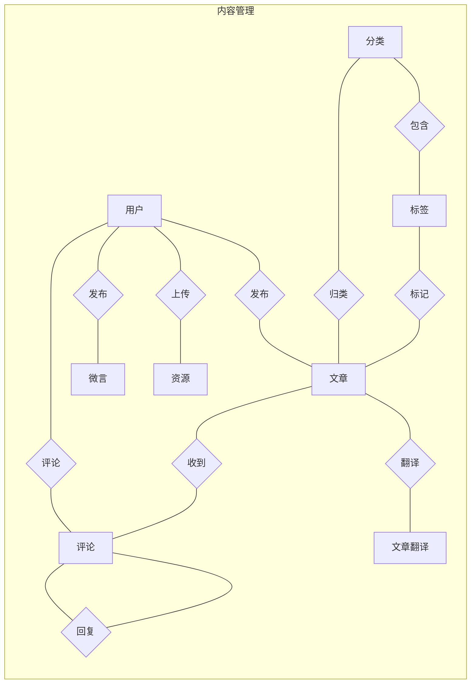
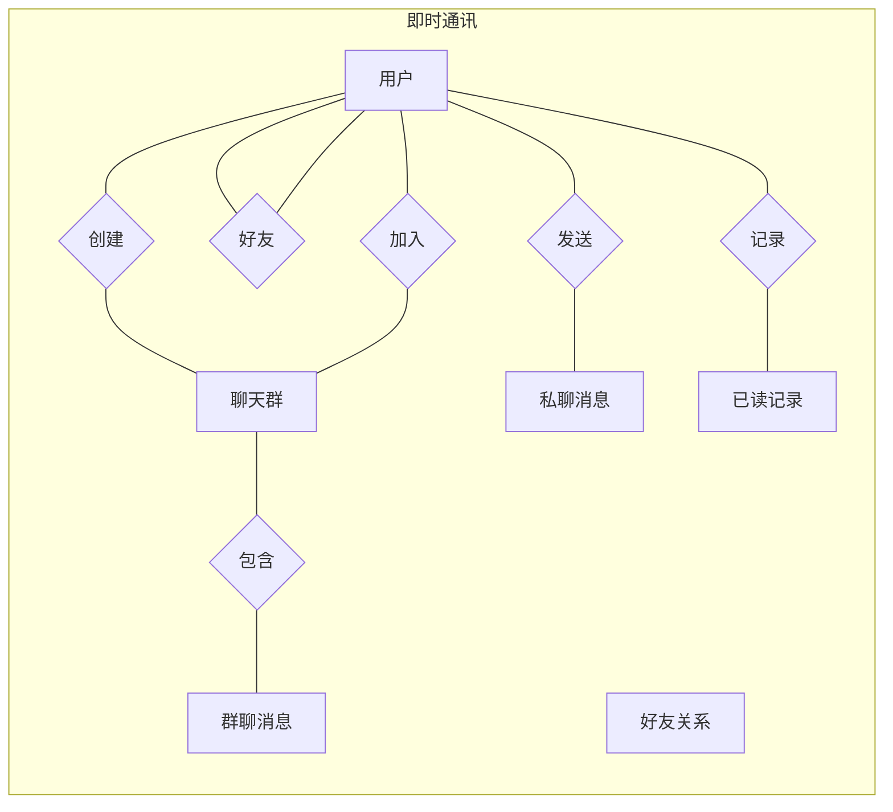
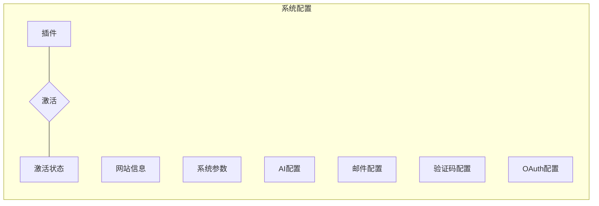
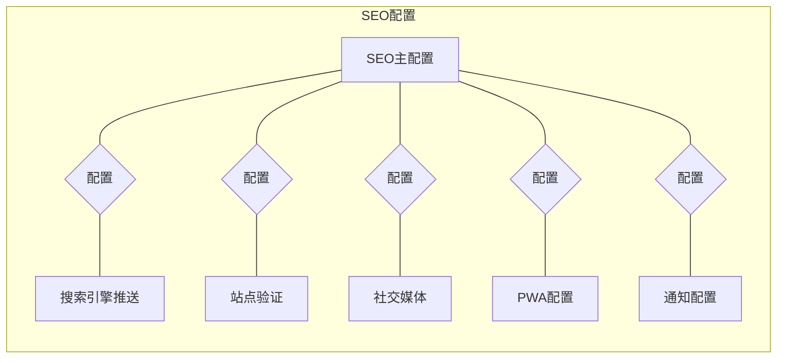
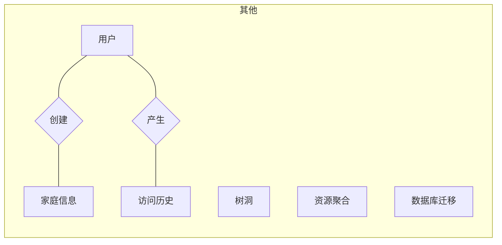

# 数据库设计文档

本文档描述 POETIZE 博客系统的数据库设计，包括表结构、字段说明、索引设计和表关系。

## 数据库概述

- **数据库名称**：poetize
- **字符集**：utf8mb4
- **排序规则**：utf8mb4_unicode_ci
- **默认引擎**：InnoDB（支持事务、外键、行级锁）
- **兼容性**：MariaDB 11+ / MySQL 5.7+

## 表分类概览

| 分类 | 表名 | 说明 |
|-----|------|------|
| **用户系统** | user | 用户信息 |
| **内容管理** | article, sort, label, article_translation | 文章、分类、标签、翻译 |
| **互动功能** | comment, wei_yan, tree_hole | 评论、微言、树洞 |
| **即时通讯** | im_chat_* | 聊天室相关（6张表） |
| **系统配置** | sys_config, web_info, sys_plugin, sys_ai_config | 系统参数配置 |
| **资源管理** | resource, resource_path | 文件资源 |
| **SEO优化** | seo_config, seo_* | SEO相关配置（6张表） |
| **第三方集成** | third_party_oauth_config, sys_mail_config | OAuth、邮件配置 |
| **其他** | family, history_info, db_migrations | 家庭页、访问记录、迁移版本 |

## 表结构详细说明

### 用户系统

#### user - 用户信息表

存储系统用户的基本信息和账户状态。

| 字段 | 类型 | 必填 | 默认值 | 说明 |
|-----|------|-----|-------|------|
| id | int | ✓ | AUTO | 主键ID |
| username | varchar(32) | | NULL | 用户名（唯一） |
| password | varchar(128) | | NULL | 密码（BCrypt加密） |
| phone_number | varchar(16) | | NULL | 手机号 |
| email | varchar(32) | | NULL | 邮箱 |
| user_status | tinyint(1) | ✓ | 1 | 是否启用 [0:否, 1:是] |
| gender | tinyint(2) | | NULL | 性别 [0:保密, 1:男, 2:女] |
| open_id | varchar(128) | | NULL | 第三方登录openId |
| platform_type | varchar(32) | | NULL | 第三方平台类型 |
| uid | varchar(128) | | NULL | 第三方平台用户唯一标识 |
| avatar | varchar(256) | | NULL | 头像URL |
| admire | varchar(32) | | NULL | 赞赏码 |
| subscribe | text | | NULL | 订阅信息 |
| introduction | varchar(4096) | | NULL | 个人简介 |
| user_type | tinyint(2) | ✓ | 2 | 用户类型 [0:admin, 1:管理员, 2:普通用户] |
| create_time | datetime | | CURRENT_TIMESTAMP | 创建时间 |
| update_time | datetime | | CURRENT_TIMESTAMP | 更新时间 |
| update_by | varchar(32) | | NULL | 最终修改人 |
| deleted | tinyint(1) | ✓ | 0 | 软删除 [0:未删除, 1:已删除] |

**索引**：
- `PRIMARY KEY (id)`
- `UNIQUE KEY uk_username (username)` - 用户名唯一

---

### 内容管理

#### article - 文章表

存储博客文章的主体内容。

| 字段 | 类型 | 必填 | 默认值 | 说明 |
|-----|------|-----|-------|------|
| id | int | ✓ | AUTO | 主键ID |
| user_id | int | ✓ | | 作者用户ID |
| sort_id | int | ✓ | | 分类ID |
| label_id | int | ✓ | | 标签ID |
| article_cover | varchar(256) | | NULL | 封面图URL |
| article_title | varchar(500) | ✓ | | 文章标题 |
| article_content | text | ✓ | | 文章内容（Markdown） |
| summary | varchar(500) | | NULL | 文章摘要 |
| video_url | varchar(1024) | | NULL | 视频链接 |
| view_count | int | ✓ | 0 | 浏览量 |
| view_status | tinyint(1) | ✓ | 1 | 是否可见 [0:否, 1:是] |
| password | varchar(128) | | NULL | 访问密码 |
| tips | varchar(128) | | NULL | 密码提示 |
| recommend_status | tinyint(1) | ✓ | 0 | 是否推荐 [0:否, 1:是] |
| comment_status | tinyint(1) | ✓ | 1 | 是否启用评论 [0:否, 1:是] |
| submit_to_search_engine | tinyint(1) | ✓ | 1 | 是否推送搜索引擎 [0:否, 1:是] |
| create_time | datetime | | CURRENT_TIMESTAMP | 创建时间 |
| update_time | datetime | | CURRENT_TIMESTAMP | 更新时间 |
| update_by | varchar(32) | | NULL | 最终修改人 |
| deleted | tinyint(1) | ✓ | 0 | 软删除 |

**索引**：
- `PRIMARY KEY (id)`
- `idx_user_id (user_id)` - 按用户查询
- `idx_sort_label (sort_id, label_id)` - 按分类标签筛选
- `idx_recommend_status (recommend_status)` - 推荐文章查询
- `idx_view_status (view_status)` - 可见状态过滤

#### sort - 分类表

| 字段 | 类型 | 必填 | 默认值 | 说明 |
|-----|------|-----|-------|------|
| id | int | ✓ | AUTO | 主键ID |
| sort_name | varchar(32) | ✓ | | 分类名称 |
| sort_description | varchar(256) | ✓ | | 分类描述 |
| sort_type | tinyint(2) | ✓ | 1 | 分类类型 [0:导航栏分类, 1:普通分类] |
| priority | int | | NULL | 优先级（数字小在前） |

#### label - 标签表

| 字段 | 类型 | 必填 | 默认值 | 说明 |
|-----|------|-----|-------|------|
| id | int | ✓ | AUTO | 主键ID |
| sort_id | int | ✓ | | 所属分类ID |
| label_name | varchar(32) | ✓ | | 标签名称 |
| label_description | varchar(256) | ✓ | | 标签描述 |

**索引**：`idx_sort_id (sort_id)`

#### article_translation - 文章翻译表

存储文章的多语言翻译内容。

| 字段 | 类型 | 必填 | 默认值 | 说明 |
|-----|------|-----|-------|------|
| id | int | ✓ | AUTO | 主键ID |
| article_id | int | ✓ | | 文章ID |
| language | varchar(10) | ✓ | | 语言代码（如 en, ja） |
| title | varchar(500) | | NULL | 翻译后的标题 |
| content | text | | NULL | 翻译后的内容 |
| summary | text | | NULL | 翻译后的摘要 |
| create_time | datetime | | CURRENT_TIMESTAMP | 创建时间 |
| update_time | datetime | | CURRENT_TIMESTAMP | 更新时间 |

**索引**：
- `UNIQUE KEY uk_article_language (article_id, language)` - 每篇文章每种语言唯一
- `idx_article_id (article_id)`

---

### 互动功能

#### comment - 评论表

支持多级嵌套评论。

| 字段 | 类型 | 必填 | 默认值 | 说明 |
|-----|------|-----|-------|------|
| id | int | ✓ | AUTO | 主键ID |
| source | int | ✓ | | 评论来源标识（如文章ID） |
| type | varchar(32) | ✓ | | 评论来源类型（article/weiyan等） |
| parent_comment_id | int | ✓ | 0 | 父评论ID（0表示顶级评论） |
| user_id | int | ✓ | | 评论用户ID |
| floor_comment_id | int | | NULL | 楼层评论ID |
| parent_user_id | int | | NULL | 被回复用户ID |
| like_count | int | ✓ | 0 | 点赞数 |
| comment_content | varchar(1024) | ✓ | | 评论内容 |
| comment_info | varchar(256) | | NULL | 评论额外信息 |
| ip_address | varchar(45) | | NULL | IP地址 |
| location | varchar(100) | | NULL | 地理位置 |
| create_time | datetime | | CURRENT_TIMESTAMP | 创建时间 |

**索引**：
- `idx_source_type (source, type)` - 按来源查询评论
- `idx_user_id (user_id)` - 按用户查询
- `idx_parent_comment_id (parent_comment_id)` - 构建评论楼层

#### wei_yan - 微言表

类似说说/动态的短内容。

| 字段 | 类型 | 必填 | 默认值 | 说明 |
|-----|------|-----|-------|------|
| id | int | ✓ | AUTO | 主键ID |
| user_id | int | ✓ | | 用户ID |
| like_count | int | ✓ | 0 | 点赞数 |
| content | varchar(1024) | ✓ | | 内容 |
| type | varchar(32) | ✓ | | 类型 |
| source | int | | NULL | 来源标识 |
| is_public | tinyint(1) | ✓ | 0 | 是否公开 [0:仅自己, 1:所有人] |
| create_time | datetime | | CURRENT_TIMESTAMP | 创建时间 |

**索引**：
- `idx_user_id (user_id)`
- `idx_source_type (source, type)`
- `idx_public_create (is_public, create_time)`

#### tree_hole - 树洞表

匿名留言功能。

| 字段 | 类型 | 必填 | 默认值 | 说明 |
|-----|------|-----|-------|------|
| id | int | ✓ | AUTO | 主键ID |
| avatar | varchar(256) | | NULL | 头像 |
| message | varchar(64) | ✓ | | 留言内容 |
| create_time | datetime | | CURRENT_TIMESTAMP | 创建时间 |

---

### 即时通讯（IM）

#### im_chat_group - 聊天群表

| 字段 | 类型 | 必填 | 默认值 | 说明 |
|-----|------|-----|-------|------|
| id | int | ✓ | AUTO | 主键ID（-1为公共聊天室） |
| group_name | varchar(32) | ✓ | | 群名称 |
| master_user_id | int | ✓ | | 群主用户ID |
| avatar | varchar(256) | | NULL | 群头像 |
| introduction | varchar(128) | | NULL | 群简介 |
| notice | varchar(1024) | | NULL | 群公告 |
| in_type | tinyint(1) | ✓ | 1 | 进入方式 [0:无需验证, 1:需审核] |
| group_type | tinyint(2) | ✓ | 1 | 类型 [1:聊天群, 2:话题] |
| create_time | datetime | | CURRENT_TIMESTAMP | 创建时间 |

#### im_chat_group_user - 群成员表

| 字段 | 类型 | 必填 | 默认值 | 说明 |
|-----|------|-----|-------|------|
| id | int | ✓ | AUTO | 主键ID |
| group_id | int | ✓ | | 群ID |
| user_id | int | ✓ | | 用户ID |
| verify_user_id | int | | NULL | 审核人ID |
| remark | varchar(1024) | | NULL | 备注 |
| admin_flag | tinyint(1) | ✓ | 0 | 是否管理员 [0:否, 1:是] |
| user_status | tinyint(2) | ✓ | | 状态 [0:未审核, 1:通过, 2:禁言] |
| create_time | datetime | | CURRENT_TIMESTAMP | 创建时间 |

**索引**：
- `UNIQUE KEY uk_group_user (group_id, user_id)`
- `idx_user_id (user_id)`

#### im_chat_user_friend - 好友表

| 字段 | 类型 | 必填 | 默认值 | 说明 |
|-----|------|-----|-------|------|
| id | int | ✓ | AUTO | 主键ID |
| user_id | int | ✓ | | 用户ID |
| friend_id | int | ✓ | | 好友ID |
| friend_status | tinyint(2) | ✓ | | 状态 [0:未审核, 1:通过] |
| remark | varchar(32) | | NULL | 备注 |
| create_time | datetime | | CURRENT_TIMESTAMP | 创建时间 |

**索引**：
- `UNIQUE KEY uk_user_friend (user_id, friend_id)`
- `idx_friend_id (friend_id)`

#### im_chat_user_message - 私聊消息表

| 字段 | 类型 | 必填 | 默认值 | 说明 |
|-----|------|-----|-------|------|
| id | bigint | ✓ | AUTO | 主键ID |
| from_id | int | ✓ | | 发送者ID |
| to_id | int | ✓ | | 接收者ID |
| content | varchar(1024) | ✓ | | 消息内容 |
| message_status | tinyint(1) | ✓ | 0 | 是否已读 [0:未读, 1:已读] |
| create_time | datetime | | CURRENT_TIMESTAMP | 创建时间 |

**索引**：`union_index (to_id, message_status)` - 查询未读消息

#### im_chat_user_group_message - 群聊消息表

| 字段 | 类型 | 必填 | 默认值 | 说明 |
|-----|------|-----|-------|------|
| id | bigint | ✓ | AUTO | 主键ID |
| group_id | int | ✓ | | 群ID |
| from_id | int | ✓ | | 发送者ID |
| to_id | int | | NULL | @某人的ID |
| content | varchar(1024) | ✓ | | 消息内容 |
| create_time | datetime | | CURRENT_TIMESTAMP | 创建时间 |

#### im_chat_last_read - 聊天已读记录表

| 字段 | 类型 | 必填 | 默认值 | 说明 |
|-----|------|-----|-------|------|
| id | int | ✓ | AUTO | 主键ID |
| user_id | int | ✓ | | 用户ID |
| chat_type | tinyint | ✓ | | 聊天类型 [1:私聊, 2:群聊] |
| chat_id | int | ✓ | | 聊天ID |
| last_read_time | datetime | ✓ | CURRENT_TIMESTAMP | 最后查看时间 |
| is_hidden | tinyint | ✓ | 0 | 是否隐藏 [0:否, 1:是] |
| create_time | datetime | | CURRENT_TIMESTAMP | 创建时间 |
| update_time | datetime | | CURRENT_TIMESTAMP | 更新时间 |

**索引**：
- `UNIQUE KEY uk_user_chat (user_id, chat_type, chat_id)`
- `idx_user_id (user_id)`
- `idx_chat (chat_type, chat_id)`
- `idx_hidden (user_id, is_hidden)`

---

### 系统配置

#### web_info - 网站信息表

存储网站的全局配置信息。

| 字段 | 类型 | 必填 | 默认值 | 说明 |
|-----|------|-----|-------|------|
| id | int | ✓ | AUTO | 主键ID |
| web_name | varchar(16) | ✓ | | 网站名称 |
| web_title | varchar(512) | ✓ | | 网站标题 |
| site_address | varchar(255) | | NULL | 网站地址（完整URL） |
| notices | varchar(512) | | NULL | 公告（JSON数组） |
| footer | varchar(256) | ✓ | | 页脚文字 |
| background_image | varchar(256) | | NULL | 背景图URL |
| avatar | varchar(256) | ✓ | | 站长头像 |
| random_avatar | text | | NULL | 随机头像列表（JSON） |
| random_name | varchar(4096) | | NULL | 随机名称列表（JSON） |
| random_cover | text | | NULL | 随机封面列表（JSON） |
| waifu_json | text | | NULL | 看板娘配置（JSON） |
| status | tinyint(1) | ✓ | 1 | 是否启用 |
| home_page_pull_up_height | int | | -1 | 首页上拉高度 |
| api_enabled | tinyint(1) | | 0 | API是否启用 |
| api_key | varchar(255) | | NULL | API密钥 |
| nav_config | text | | NULL | 导航栏配置（JSON） |
| enable_waifu | tinyint(1) | | 0 | 看板娘是否启用 |
| waifu_display_mode | varchar(20) | | 'live2d' | 看板娘模式 [live2d, button] |
| footer_background_image | varchar(256) | | NULL | 页脚背景图 |
| footer_background_config | text | | NULL | 页脚背景配置（JSON） |
| email | varchar(255) | | NULL | 联系邮箱 |
| minimal_footer | tinyint(1) | | 0 | 极简页脚开关 |
| enable_auto_night | tinyint(1) | | 0 | 自动夜间模式 |
| auto_night_start | int | | 23 | 夜间开始时间（小时） |
| auto_night_end | int | | 7 | 夜间结束时间（小时） |
| enable_gray_mode | tinyint(1) | | 0 | 灰色模式开关 |
| enable_dynamic_title | tinyint(1) | | 1 | 动态标题开关 |
| mobile_drawer_config | text | | NULL | 移动端侧边栏配置（JSON） |
| mouse_click_effect | varchar(20) | | 'none' | 鼠标点击效果 [none, text, firework] |
| mouse_click_effect_config | text | | NULL | 点击效果配置（JSON） |

#### sys_config - 系统参数配置表

键值对形式存储系统配置。

| 字段 | 类型 | 必填 | 默认值 | 说明 |
|-----|------|-----|-------|------|
| id | int | ✓ | AUTO | 主键ID |
| config_name | varchar(128) | ✓ | | 配置名称 |
| config_key | varchar(64) | ✓ | | 配置键名 |
| config_value | text | | NULL | 配置值 |
| config_type | char(1) | ✓ | | 类型 [1:私用, 2:公开] |

**索引**：`UNIQUE KEY uk_config_key_type (config_key, config_type)`

#### sys_plugin - 插件配置表

| 字段 | 类型 | 必填 | 默认值 | 说明 |
|-----|------|-----|-------|------|
| id | int | ✓ | AUTO | 主键ID |
| plugin_type | varchar(50) | ✓ | | 插件类型 |
| plugin_key | varchar(50) | ✓ | | 插件标识符 |
| plugin_name | varchar(100) | ✓ | | 插件名称 |
| plugin_description | varchar(500) | | NULL | 插件描述 |
| plugin_config | text | | NULL | 插件配置（JSON） |
| plugin_code | text | | NULL | 插件代码（JavaScript） |
| enabled | tinyint(1) | ✓ | 1 | 是否启用 |
| is_system | tinyint(1) | ✓ | 0 | 是否系统内置 |
| sort_order | int | ✓ | 0 | 排序顺序 |
| create_time | datetime | ✓ | CURRENT_TIMESTAMP | 创建时间 |
| update_time | datetime | ✓ | CURRENT_TIMESTAMP | 更新时间 |

**索引**：
- `UNIQUE KEY uk_plugin_type_key (plugin_type, plugin_key)`
- `idx_plugin_type (plugin_type)`
- `idx_enabled (enabled)`

#### sys_plugin_active - 插件激活状态表

| 字段 | 类型 | 必填 | 默认值 | 说明 |
|-----|------|-----|-------|------|
| id | int | ✓ | AUTO | 主键ID |
| plugin_type | varchar(50) | ✓ | | 插件类型 |
| plugin_key | varchar(50) | ✓ | | 当前激活的插件标识符 |
| update_time | datetime | ✓ | CURRENT_TIMESTAMP | 更新时间 |

**索引**：`UNIQUE KEY uk_plugin_type (plugin_type)` - 每种类型只能有一个激活项

#### sys_ai_config - AI配置统一管理表

统一管理 AI 聊天、AI API、文章 AI 助手等配置。

| 字段 | 类型 | 必填 | 默认值 | 说明 |
|-----|------|-----|-------|------|
| id | int | ✓ | AUTO | 主键ID |
| config_type | varchar(50) | ✓ | | 配置类型 [ai_chat, ai_api, article_ai] |
| config_name | varchar(100) | | 'default' | 配置名称 |
| enabled | tinyint(1) | | 0 | 是否启用 |
| provider | varchar(50) | | NULL | AI服务提供商 |
| api_key | varchar(500) | | NULL | API密钥（加密存储） |
| api_base | varchar(500) | | NULL | API基础地址 |
| model | varchar(100) | | NULL | 模型名称 |
| temperature | decimal(3,2) | | 0.70 | 温度参数 |
| max_tokens | int | | 1000 | 最大生成令牌数 |
| ... | ... | | | （更多AI相关配置字段） |
| extra_config | json | | NULL | 扩展配置（JSON） |
| create_time | datetime | | CURRENT_TIMESTAMP | 创建时间 |
| update_time | datetime | | CURRENT_TIMESTAMP | 更新时间 |

**索引**：
- `UNIQUE KEY uk_config_type_name (config_type, config_name)`
- `idx_config_type (config_type)`
- `idx_enabled (enabled)`

---

### 资源管理

#### resource - 资源信息表

存储上传的文件资源信息。

| 字段 | 类型 | 必填 | 默认值 | 说明 |
|-----|------|-----|-------|------|
| id | int | ✓ | AUTO | 主键ID |
| user_id | int | ✓ | | 上传用户ID |
| type | varchar(32) | ✓ | | 资源类型 |
| path | varchar(256) | ✓ | | 资源路径（唯一） |
| size | int | | NULL | 文件大小（字节） |
| original_name | varchar(512) | | NULL | 原始文件名 |
| mime_type | varchar(256) | | NULL | MIME类型 |
| status | tinyint(1) | ✓ | 1 | 是否启用 |
| store_type | varchar(16) | | NULL | 存储平台 [local, qiniu, lsky, easyimage] |
| create_time | datetime | | CURRENT_TIMESTAMP | 创建时间 |

**索引**：
- `UNIQUE KEY uk_path (path)`
- `idx_user_type (user_id, type)`

#### resource_path - 资源聚合表

用于友链、收藏夹等资源聚合展示。

| 字段 | 类型 | 必填 | 默认值 | 说明 |
|-----|------|-----|-------|------|
| id | int | ✓ | AUTO | 主键ID |
| title | varchar(64) | ✓ | | 标题 |
| classify | varchar(32) | | NULL | 分类 |
| cover | varchar(256) | | NULL | 封面 |
| url | varchar(256) | | NULL | 链接 |
| introduction | varchar(1024) | | NULL | 简介 |
| type | varchar(32) | ✓ | | 资源类型 |
| status | tinyint(1) | ✓ | 1 | 是否启用 |
| remark | text | | NULL | 备注 |
| create_time | datetime | | CURRENT_TIMESTAMP | 创建时间 |

---

### SEO优化

#### seo_config - SEO主配置表

| 字段 | 类型 | 必填 | 默认值 | 说明 |
|-----|------|-----|-------|------|
| id | int | ✓ | AUTO | 主键ID |
| enable | tinyint(1) | | 1 | SEO功能总开关 |
| site_description | text | | NULL | 网站描述 |
| site_keywords | text | | NULL | 网站关键词 |
| site_logo | varchar(512) | | NULL | 网站Logo |
| site_icon | varchar(512) | | NULL | 网站图标 |
| default_author | varchar(128) | | 'Admin' | 默认作者 |
| custom_head_code | text | | NULL | 自定义头部代码 |
| robots_txt | text | | NULL | robots.txt内容 |
| auto_generate_meta_tags | tinyint(1) | | 1 | 自动生成元标签 |
| generate_sitemap | tinyint(1) | | 1 | 生成站点地图 |
| sitemap_change_frequency | varchar(32) | | 'weekly' | 站点地图更新频率 |
| sitemap_priority | varchar(8) | | '0.7' | 站点地图优先级 |
| create_time | datetime | | CURRENT_TIMESTAMP | 创建时间 |
| update_time | datetime | | CURRENT_TIMESTAMP | 更新时间 |

**关联子表**：
- `seo_search_engine_push` - 搜索引擎推送配置
- `seo_site_verification` - 网站验证配置
- `seo_social_media` - 社交媒体配置
- `seo_pwa_config` - PWA配置
- `seo_notification_config` - 通知配置

---

### 第三方集成

#### third_party_oauth_config - OAuth登录配置表

| 字段 | 类型 | 必填 | 默认值 | 说明 |
|-----|------|-----|-------|------|
| id | int | ✓ | AUTO | 主键ID |
| platform_type | varchar(32) | ✓ | | 平台类型（唯一） |
| platform_name | varchar(64) | | NULL | 平台名称 |
| client_id | varchar(256) | | NULL | 客户端ID |
| client_secret | varchar(512) | | NULL | 客户端密钥 |
| client_key | varchar(256) | | NULL | 客户端Key（Twitter用） |
| redirect_uri | varchar(512) | | NULL | 重定向URI |
| scope | varchar(256) | | NULL | 授权范围 |
| enabled | tinyint(1) | ✓ | 0 | 是否启用该平台 |
| global_enabled | tinyint(1) | ✓ | 0 | 全局是否启用第三方登录 |
| sort_order | int | | 0 | 排序顺序 |
| remark | varchar(512) | | NULL | 备注 |
| create_time | datetime | | CURRENT_TIMESTAMP | 创建时间 |
| update_time | datetime | | CURRENT_TIMESTAMP | 更新时间 |
| deleted | tinyint(1) | ✓ | 0 | 软删除 |

**支持的平台**：GitHub、Google、Twitter、Yandex、Gitee、QQ、Baidu

#### sys_mail_config - 邮件配置表

| 字段 | 类型 | 必填 | 默认值 | 说明 |
|-----|------|-----|-------|------|
| id | int | ✓ | AUTO | 主键ID |
| config_name | varchar(100) | ✓ | | 配置名称 |
| host | varchar(255) | ✓ | | 邮箱服务器地址 |
| port | int | ✓ | 25 | 端口 |
| username | varchar(255) | ✓ | | 邮箱账号 |
| password | varchar(500) | | NULL | 密码/授权码（加密） |
| sender_name | varchar(100) | | NULL | 发件人名称 |
| use_ssl | tinyint(1) | | 0 | 是否启用SSL |
| use_starttls | tinyint(1) | | 0 | 是否启用STARTTLS |
| auth | tinyint(1) | | 1 | 是否需要认证 |
| enabled | tinyint(1) | | 1 | 是否启用 |
| is_default | tinyint(1) | | 0 | 是否为默认配置 |
| ... | ... | | | （更多邮件配置字段） |

#### sys_captcha_config - 验证码配置表

| 字段 | 类型 | 必填 | 默认值 | 说明 |
|-----|------|-----|-------|------|
| id | int | ✓ | AUTO | 主键ID |
| enable | tinyint(1) | | 0 | 是否启用验证码 |
| login | tinyint(1) | | 1 | 登录时启用 |
| register | tinyint(1) | | 1 | 注册时启用 |
| comment | tinyint(1) | | 0 | 评论时启用 |
| reset_password | tinyint(1) | | 1 | 重置密码时启用 |
| slide_accuracy | int | | 5 | 滑动验证码精确度 |
| slide_success_threshold | decimal(3,2) | | 0.95 | 滑动成功阈值 |
| ... | ... | | | （更多验证码配置字段） |

---

### 其他

#### family - 家庭信息表

用于"家"页面展示情侣/家庭信息。

| 字段 | 类型 | 必填 | 默认值 | 说明 |
|-----|------|-----|-------|------|
| id | int | ✓ | AUTO | 主键ID |
| user_id | int | ✓ | | 用户ID |
| bg_cover | varchar(256) | ✓ | | 背景封面 |
| man_cover | varchar(256) | ✓ | | 男生头像 |
| woman_cover | varchar(256) | ✓ | | 女生头像 |
| man_name | varchar(32) | ✓ | | 男生昵称 |
| woman_name | varchar(32) | ✓ | | 女生昵称 |
| timing | varchar(32) | ✓ | | 计时起始日期 |
| countdown_title | varchar(32) | | NULL | 倒计时标题 |
| countdown_time | varchar(32) | | NULL | 倒计时时间 |
| status | tinyint(1) | ✓ | 1 | 是否启用 |
| family_info | varchar(1024) | | NULL | 额外信息 |
| like_count | int | ✓ | 0 | 点赞数 |
| create_time | datetime | | CURRENT_TIMESTAMP | 创建时间 |
| update_time | datetime | | CURRENT_TIMESTAMP | 更新时间 |

#### history_info - 访问历史表

记录用户访问信息。

| 字段 | 类型 | 必填 | 默认值 | 说明 |
|-----|------|-----|-------|------|
| id | int | ✓ | AUTO | 主键ID |
| user_id | int | | NULL | 用户ID |
| ip | varchar(128) | ✓ | | IP地址 |
| nation | varchar(64) | | NULL | 国家 |
| province | varchar(64) | | NULL | 省份 |
| city | varchar(64) | | NULL | 城市 |
| create_time | datetime | | CURRENT_TIMESTAMP | 创建时间 |

#### db_migrations - 数据库迁移版本记录表

用于跟踪已执行的数据库迁移脚本。

| 字段 | 类型 | 必填 | 默认值 | 说明 |
|-----|------|-----|-------|------|
| id | int | ✓ | AUTO | 主键ID |
| version | varchar(20) | ✓ | | 版本号（脚本文件名） |
| description | varchar(200) | | NULL | 迁移说明 |
| executed_at | datetime | ✓ | CURRENT_TIMESTAMP | 执行时间 |
| execution_time_ms | int | | NULL | 执行耗时（毫秒） |
| success | tinyint(1) | ✓ | 1 | 是否执行成功 |

**索引**：`UNIQUE KEY uk_version (version)`

---

## ER 关系图

> 以下为 Chen 记法风格的实体-关系图。矩形为实体，菱形为关系，字段详情请参考上方表结构说明。

### 核心业务模块

### 即时通讯模块

### 系统配置模块

### SEO配置模块

### 其他模块

## 设计说明

### 软删除策略

以下表使用 `deleted` 字段实现软删除：
- user
- article
- third_party_oauth_config

### 时间字段规范

- `create_time` - 创建时间，默认 `CURRENT_TIMESTAMP`
- `update_time` - 更新时间，使用 `ON UPDATE CURRENT_TIMESTAMP` 自动更新

### 存储引擎选择

| 引擎 | 适用场景 | 本项目使用 |
|-----|---------|-----------|
| InnoDB | 事务型表（用户、文章、评论） | 默认引擎 |
| Aria | 读密集型表（分类、标签、配置） | poetry.sql 中使用 |
| RocksDB | 写入优化表（聊天记录） | poetry.sql 中使用 |

> 注：`poetry_old.sql` 统一使用 InnoDB，兼容 MySQL 5.7+

### 索引设计原则

1. 主键使用自增 INT/BIGINT
2. 外键字段添加普通索引
3. 常用查询条件添加复合索引
4. 唯一业务键添加唯一索引

## 相关文档

- [SQL 脚本说明](../poetize-server/sql/README.md) - 迁移脚本规范
- [开发指南](./开发指南.md) - 数据库环境配置
- [架构设计](./架构设计.md) - 系统整体架构
